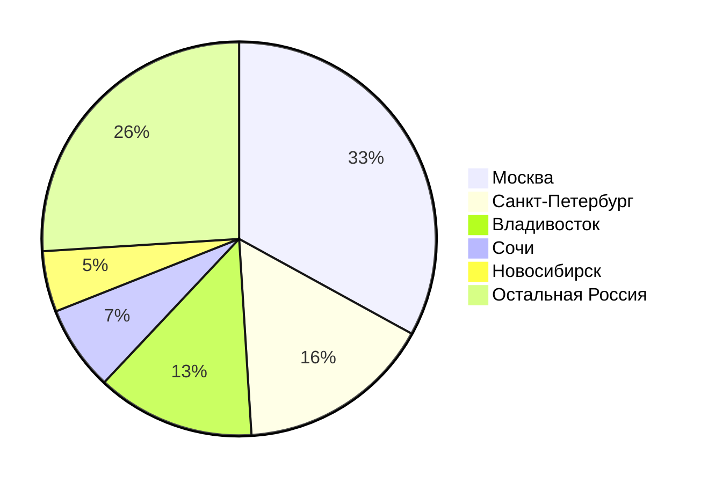
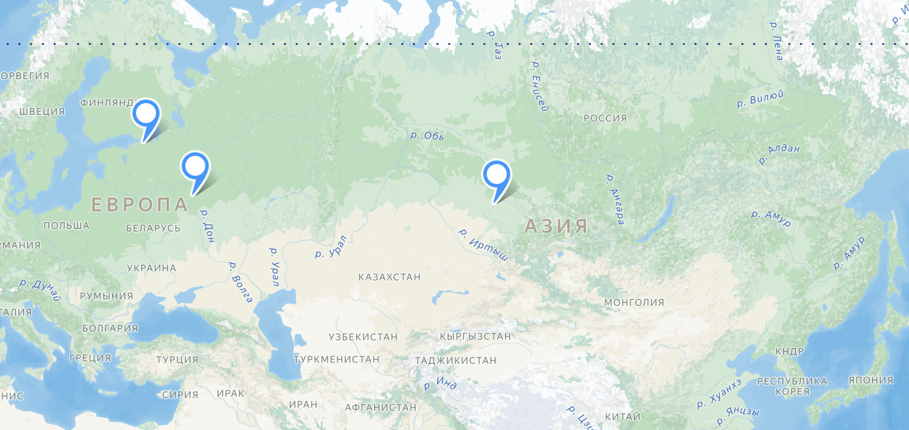

# Auto.ru

## Содержание

- [Auto.ru](#auto.ru)
  - [Содержание](#содержание)
    - [Основная часть](#основная-часть)
    - [1. Тема и целевая аудитория](#1-тема-и-целевая-аудитория)
      - [Целевая аудитория](#целевая-аудитория)
        - [Анализ трафика](#анализ-трафика)
        - [Веб-трафик](#веб-трафик)
      - [Функционал](#функционал)
    - [2. Расчет нагрузки](#2-расчет-нагрузки)
      - [Продуктовые метрики](#продуктовые-метрики)
        - [Месячная и дневная аудитория](#месячная-и-дневная-аудитория)
        - [Пользовательская активность](#пользовательская-активность)
        - [Объем данных](#объем-данных)
      - [Технические метрики](#технические-метрики)
        - [Сетевой трафик](#сетевой-трафик)
          - [Пиковое потребление трафика](#пиковое-потребление-трафика)
          - [RPS во время пикового потребления](#rps-во-время-пикового-потребления)
          - [Просмотр объявления](#просмотр-объявления)
          - [Поиск объявления](#поиск-объявления)
          - [Загрузка страницы](#загрузка-страницы)
          - [Загрузка фотографии](#загрузка-фотографии)
          - [Другие запросы](#другие-запросы)
        - [Оценка суммарного суточного трафика в Гб](#оценка-суммарного-суточного-трафика-в-гб)
          - [Общий суммарный суточный трафик](#общий-сумарный-суточный-трафик)
        - [RPS по методам запросов](#rps-по-методам-запросов)
      - [3. Глобальная балансировка нагрузки](#3-глобальная-балансировка-нагрузки)
        - [Функциональное разбиение по доменам](#функциональное-разбиение-по-доменам) 
        - [Обоснования расположения ДЦ](#обоснования-расположения-дц)
        - [Расчет распределения запросов по типам запросов и ДЦ](#расчет-распределения-запросов-по-типам-запросов-и-дц)
        - [Схема DNS балансировки](#схема-dns-балансировки)
        - [Схема Anycast балансировки](#схема-anycast-балансировки)
        - [Механизм регулировки трафика между ДЦ](#механизм-регулировки-трафика-между-дц)
  - [Список источников](#список-источников)

## Основная часть

### 1. Тема и целевая аудитория

Сервис "Авто.ру"[^1] является популярной платформой для покупки и продажи транспортных средств, а также предоставляет различные услуги, связанные с автомобилями.

#### Целевая аудитория

Целевая аудитория сервиса включает:
- **Размер аудитории**: более 30 миллионов активных пользователей в месяц [^2]
- **Местоположение**: Россия и страны СНГ

##### Анализ трафика

| Метрика                               | Значение                  |
|---------------------------------------|--------------------------|
| **Месячная аудитория**                | 30 000 000 пользователей   |
| **Дневная аудитория**                 | 2 500 000 пользователей      |
| **Среднее количество посещенных страниц пользователем**                 | 9.57 |      |
| **Среднее время посещения**           | 00:04:53                            |

Поскольку в месяц аудитория 30 миллионов, а среднем пользователь посещает сайт 2.5 дня в месяца [^3], следовательно в среднем 2.5 миллионов уникальных пользователей заходит на сайт в день (30 миллионов за месяц * 2.5 дня / 30 дня = 2.5 миллиона)

##### Веб-трафик
 [^4]

#### Функционал

Для разработки MVP сервиса "Авто.ру" были выделены следующие ключевые функции:
1. **Создание объявления о продаже автомобиля**: пользователи могут создавать объявления с описанием и фотографиями.
2. **Поиск автомобилей по фильтрам**: пользователи могут искать автомобили по различным критериям (марка, модель, цена и т.д.).
3. **Оценка стоимости автомобиля**: сервис предоставляет возможность оценить стоимость автомобиля на основе рыночных данных.
4. **Обратная связь с продавцом**: пользователи могут связываться с продавцами через встроенный мессенджер.
5. **История цен на автомобили**: пользователи могут видеть динамику цен на интересующие их модели.
6. **Регистрация**: пользователи создают аккаунты, добавляют фотографии профиля и информацию о себе.
7. Рекомендации
8. Избранное

### 2. Расчет нагрузки

#### Продуктовые метрики

##### Месячная и дневная аудитория

  - Месячная аудитория: 30 млн. человек
  - Дневная аудитория: 2.5 млн. человек

##### Пользовательская активность

- **Просмотр объявлений**:
  - В среднем пользователь смотрит 10 объявлений за раз и заходит на сайт 2.5 раза в месяц.
  - Общее количество просмотров в месяц: 2.5 * 10 = 25 объявлений [^2]
  - В день это составит: 25 / 30 = 0.83 объявлений
  - Общее количество просмотров объявлений в день для всей аудитории: 0.83 * 2.5 = 2 08 млн. просмотров 

##### Объем данных

- **Количество объявлений**: 700 тыс. [^1]
- **Количество фотографий**:
  - Среднее количество фотографий на одно объявление: (12 + 35) / 2 = 23.5
  - Общее количество фотографий для всех объявлений: 183000 * 23.5 = 16.3 млн. фотографий
- **Количество пользователей**:
  - Допустим, что 30 млн пользователей зарегистрированы на сайте и имеют заполненную информацию, которая весит 1 Мб, тогда: 30 000 000 * 1 Мб = 30 000 ГБ  

- **Средний размер фотографий**:

  - Предполагаемый размер одной фотографии: 200 Кб.
  - Общий объем фотографий на сервисе: 16.3 млн * 200 Кб = 3 268 000 Мб = 3 200 Гб

- **Итоговая нагрузка**:

  - Дневная нагрузка: примерно 2.08 млн. объявлений в день.
  - Объем данных: общий объем фотографий на сервисе составляет около 3 200 Гб.
  - Общий объем данных объялений: 700 Гб + 3200 ГБ + 30 Гб = 3 930 Гб ≈ 4 ТБ

| Данные         | Количество | ГБ |
|-----------------------|-------------|-------------|
| Описание объвляения    | 700 000 |     700    |
| Пользовательская информация       | 30 000 000 |   30     |
| Фотографии      |  16 300 000 |   3 200     |
| Итог      |  - |   3 930    |

#### Технические метрики

##### Сетевой трафик

##### Оценка суммарного суточного трафика в Гб
  Чтобы оценить суммарный суточный трафик в гигабайтах, можно использовать средние значения RPS и предположить средний размер данных для каждого типа запроса.
  
  - Просмотр объявления: допустим размер одного запроса составляет 50 КБ.
  - Поиск объявления: допустим размер одного запроса составляет 30 КБ.
  - Загрузка страницы: допустим размер одного запроса составляет 100 КБ.
  - Загрузка фотографии: допустим размер одного запроса составляет 1 МБ.
  - Создание объявления: допустим размер одного запроса составляет 5000 КБ.
  - Регистриция: допустим размер одного запроса составляет 400 КБ.
  - Авторизация: допустим размер одного запроса составляет 400 КБ.
  - Отправка сообщения в чате: допустим размер одного запроса составляет 1 КБ.
  - Получение сообщения в чате: допустим размер одного запроса составляет 1 КБ.
  - Другие запросы: допустим размер одного запроса составляет 20 КБ.
  
  Теперь можно рассчитать суммарный суточный трафик:
  
  - Просмотр объявления:
    Трафик =  13 750 000 × 50 КБ = 687 500 000 КБ = (687 500 000)/1 024² ≈ 655 Гбайт
    
  - Поиск объявления:
    Трафик =  8 250 000 × 30 КБ = 247 500 000 КБ = (247 500 000)/1 024² ≈ 235 Гбайт
    
  - Загрузка страницы:
    Трафик =  2 750 000 × 100 КБ = 275 000 000 КБ = (275 000 000)/1 024² ≈ 262 Гбайт
    
  - Загрузка фотографии:
    Трафик =  1 375 000 × 1 МБ = 1 375 000 КБ = (1 375 000)/1 024² ≈ 1.31 Гбайт
    
  - Создание объявления:
    Трафик = 2 500 × 5 000 КБ = 12 500 000 КБ = (12 500 000 / 1 024²) ≈ 11.91 Гбайт
    
  - Регистрация:
    Трафик = 25 000 × 400 КБ = 10 000 000 КБ = (10 000 000 / 1 024²) ≈ 9.54 Гбайт
    
  - Авторизация:
    Трафик = 250 000 × 400 КБ = 100 000 000 КБ = (100 000 000 / 1 024²) ≈ 95.37 Гбайт
    
  - Отправка сообщения в чате:
    Трафик = 75 000 000 × 1 КБ = 75 000 000 КБ = (75 000 000 / 1 024²) ≈ 71.53 Гбайт
    
  - Получение сообщения в чате:
    Трафик = 75 000 000 × 1 КБ = 75 000 000 КБ = (75 000 000 / 1 024²) ≈ 71.53 Гбайт
    
  - Другие запросы:
    Трафик =  1 375 000 × 20 КБ = 27 500 000 КБ = (27 500 000)/1 024² ≈ 26 Гбайт

    

###### Общий суммарный суточный трафик

| Тип запроса          | Количество запросов | Размер запроса | Трафик (ГБ) | Средний трафик (Гбит/с) |
|----------------------|---------------------|----------------|--------------|--------------------------|
| Просмотр объявления   | 13 750 000          | 50 КБ          | ≈ 655        | ≈ 0.0607                 |
| Поиск объявления      | 8 250 000           | 30 КБ          | ≈ 235        | ≈ 0.0218                 |
| Загрузка страницы     | 2 750 000           | 100 КБ         | ≈ 262        | ≈ 0.0242                 |
| Загрузка фотографии   | 1 375 000           | 1 МБ           | ≈ 1.31       | ≈ 0.000121               |
| Создание объявления      | 2500           | 5000 КБ          | ≈ 12         | ≈ 0.0011                |
| Регистрация        | 25 000           | 400 КБ          | ≈ 10         | ≈ 0.00093                |
| Авторизация        | 25 000           | 400 КБ          | ≈ 10         | ≈ 0.00093                |
| Отправка сообщения в чате       | 75 000 000           | 1 КБ          | ≈ 71         | ≈ 0.00662                |
| Получение сообщения в чате       | 75 000 000           | 1 КБ          | ≈ 71         | ≈ 0.00662                |
| Другие запросы       | 1 375 000           | 20 КБ          | ≈ 26         | ≈ 0.00241                |
| Итого            | 177 600 000      |        6000 КБ        | ≈ 1 450  |                 ≈ 0.135        |

- Общий трафик: ≈ **1 450 ГБ**
- Средний трафик: ≈ **0.135 Гбит/с**

##### RPS по методам запросов

| Метод запроса                        | Количество на пользователя в сутки | Общее количество в сутки | Среднее RPS | Пиковое RPS |
|--------------------------------------|-----------------------------------|-------------------------|-------------|--------------|
| Регистрация                          | 0.01                                | 25 000                  | ~0.29       | ~1         |
| Авторизация                         | 0.01                                 | 25 000                 | ~0.29       | ~1         |
| Создание объявления                 | 0.001                                 | 2 500                  | ~0.03       | ~0.08          |
| Поиск                               | 3.3                                 | 8 250 000                 | ~95.4       | ~200        |
| Просмотр объявления                 | 5.5                                 | 13 750 000               | ~159       | ~300        |
| Добавить объявление в избранное    | 0.4                                | 120 000                 | ~13.9       | ~30         |
| Отправка сообщения в чате          | 5                                 | 75 000 000                  | ~867       | ~2 000         |
| Получение сообщения в чате          | 5                                 | 75 000 000                  | ~867      | ~2 000         |

### 3. Глобальная балансировка нагрузки

#### Функциональное разбиение по доменам
- **[Домен 1](https://auto.ru)**: Основной интерфейс (поиск и просмотр объявлений)
- **[Домен 2](https://auth.auto.ru/login/)**: Пользовательский интерфейс (регистрация, авторизация)
- **[Домен 3](https://auto.ru/rossiya/cars/used/)**: Просмотр объявлений
- **[Домен 4](https://auto.ru/my/)**: Административный интерфейс (управление объявлениями)

#### Обоснования расположения ДЦ
- **Критерии выбора**:
  - **Задержка**: Выбор ДЦ ближе к целевым пользователям для уменьшения времени отклика.
  - **Надежность**: Размещение в разных географических регионах для обеспечения отказоустойчивости.
  - **Зависимость от трафика**: Учет пикового времени использования и распределение нагрузки по регионам.
  
- **Влияние на продуктовые метрики**:
  - Уменьшение времени загрузки страниц.
  - Повышение качества обслуживания пользователей (QoS).
  - Устойчивость к сбоям и обеспечение доступности сервиса.
 
Выбор расположения ДЦ будем делать из логических соображений о количестве автомобилей и необходимости покупки личного транспортного средства.
  
Можно предположить, что в Москве будет наибольшее количество пользователей, покупок/продаж и объявлений, так как это наибольший город страны. Санкт-Петербург второй по населению. А вот Новосибирск, хоть и третий в списке городов по населению, имеет всего 35к объявлений на Auto.ru, когда в Владивостоке 90к, потому что он близок к границам, и есть возможность ввозить машины из других стран.
 
| **Город** | **Активные объявления** |
| - | - |
| Москва | [230К](https://auto.ru/moskva/cars/all/) |
| Санкт-Петербург | [110К](https://auto.ru/sankt-peterburg/cars/all/) |
| Владивосток | [90К](https://auto.ru/vladivostok/) |
| Сочи | [50К](https://auto.ru/sochi/cars/all/) |
| Новосибирск |  [35К](https://auto.ru/novosibirsk/cars/all/) |

Исходя из количества активных объявлений в городе, в котором расположен дата-центр, а также близлежащих городов, получаем следующее распределение запросов по дата-центрам:

#### Расчет распределения запросов по типам запросов и ДЦ

| Тип запроса          | Количество запросов | Москва         | Санкт-Петербург | Владивосток   | Сочи       | Новосибирск | Остальная Россия |
|----------------------|---------------------|----------------|------------------|---------------|------------|-------------|------------------|
| Просмотр объявления   | 13 750 000          |    4 537 500    |      2 200 000      | 1 787 500 | 962 500 | 687 500 | 3 575 000 |
| Поиск объявления      | 8 250 000           |    2 722 500    |      1 320 000      | 1 072 500 | 577 500 | 412 500 | 2 145 000 |
| Загрузка страницы     | 2 750 000           |    907 500      |       440 000       | 357 500 | 192 500 | 137 500 | 715 000 |
| Загрузка фотографии   | 1 375 000           |    456 250      |       220 000       | 178 750 | 96 250 | 68 750 | 357 500 |
| Создание объявления   | 2 500               |    825           |        400           | 325     | 175     | 125     | 650          |
| Добавление объявления в избранное   | 120 000               |    39 600           |        19 200           | 15 600     | 8 400     | 6000     | 31 200          |
| Регистрация           | 25 000               |    8 250        |        4 000        | 3 250    | 1 750    | 1 250    | 6 500        |
| Авторизация          | 25 000               |    8 250       |       4 000        | 3 250    | 1 750    | 1 250    | 6 500       |
| Отправка в чате      | 150 000 000         |    49 500 000      |     24 000 000     | 19 500 000| 10 500 000| 7 500 000| 39 000 000 |
| Другие запросы       | 1 375 000           |    453 750      |       220 000       | 178 750 | 96 250 | 68 750 | 357 500 |
| Итог  | 177 700 000              |    58 600 000           |        28 400 000           | 23 101 000     | 12 500 000     | 8 900 000     | 46 200 000          |

#### Схема DNS балансировки

Будем использовать Latency-Based DNS, чтобы определять местоположение пользователя в сети и направлять его в ближайший дата-центр с учетом задержки сети. 

Если ближайший датацентр перегружен или недоступен, запрос может быть перенаправлен в резервный регион.

#### Схема Anycast балансировки
 - Общий IP-адрес: Все дата-центры (например, в Москве, Санкт-Петербурге, Владивосток и других городах) имеют один и тот же IP-адрес, который используется для доступа к сервису.

 - DNS-серверы: DNS-серверы могут использоваться для разрешения доменного имени (например, auto.ru) в общий Anycast IP-адрес.

 - Маршрутизаторы: Каждый ДЦ настроен на объявление своего Anycast IP-адреса через протоколы маршрутизации (BGP).

#### Механизм регулировки трафика между ДЦ
- Использование CDN (Content Delivery Network) позволяет разместить часто запрашиваемый контент (например, изображения, скрипты и статические файлы) ближе к конечным пользователям, тем самым снижая нагрузку на основные ДЦ.

## Список источников

[^1]: [Официальный сайт Auto.ru](https://www.auto.ru) - информация о функционале и услугах.
[^2]: [SpyMetrics](https://spymetrics.ru/ru/website/auto.ru) - анализ трафика auto.ru
[^3]: [Yandex](https://yandex.ru/support/autoru-legal/ru) - о сервисе для партнеров
[^4]: [Website Analysis similarweb](https://www.similarweb.com/ru/website/auto.ru) - анализ веб-трафика auto.ru

