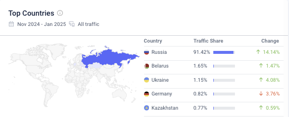

# Auto.ru

## Содержание

- [Auto.ru](#auto.ru)
  - [Содержание](#содержание)
    - [Основная часть](#основная-часть)
    - [1. Тема и целевая аудитория](#1-тема-и-целевая-аудитория)
      - [Целевая аудитория](#целевая-аудитория)
        - [Анализ трафика](#анализ-трафика)
        - [Веб-трафик](#веб-трафик)
      - [Функционал](#функционал)
   
  - [Список источников](#список-источников)

## Основная часть

### 1. Тема и целевая аудитория

Сервис "Авто.ру"[^1] является популярной платформой для покупки и продажи транспортных средств, а также предоставляет различные услуги, связанные с автомобилями.

#### Целевая аудитория

Целевая аудитория сервиса включает:
- **Размер аудитории**: более 30 миллионов активных пользователей в месяц
- **Местоположение**: Россия и страны СНГ

##### Анализ трафика

| Метрика                               | Значение                  |
|---------------------------------------|--------------------------|
| **Месячная аудитория**                | 30,000,000 пользователей   |
| **Дневная аудитория**                 | 2,500,000 пользователей      |
| **Среднее количество посещенных страниц пользователем**                 | 9.57 |      |
| **Среднее время посещения**           | 00:04:53                            |

Поскольку в месяц аудитория 30 миллионов, а в день заходят 2 миллиона, следовательно в среднем пользователь посещает сайт 2,5 раза в месяц

##### Веб-трафик
 [^2]

#### Функционал

Для разработки MVP сервиса "Авто.ру" были выделены следующие ключевые функции:
1. **Создание объявления о продаже автомобиля**: пользователи могут создавать объявления с описанием и фотографиями.
2. **Поиск автомобилей по фильтрам**: пользователи могут искать автомобили по различным критериям (марка, модель, цена и т.д.).
3. **Оценка стоимости автомобиля**: сервис предоставляет возможность оценить стоимость автомобиля на основе рыночных данных.
4. **Обратная связь с продавцом**: пользователи могут связываться с продавцами через встроенный мессенджер.
5. **История цен на автомобили**: пользователи могут видеть динамику цен на интересующие их модели.
6. **Услуги по оформлению кредита**: пользователи могут получить информацию о возможных вариантах кредитования для покупки автомобиля.

## Список источников

[^1]: [Официальный сайт Auto.ru](https://www.auto.ru) - информация о функционале и услугах.
[^2]: [Website Analysis similarweb](https://www.similarweb.com/ru/website/auto.ru) - анализ веб-трафика auto.ru

